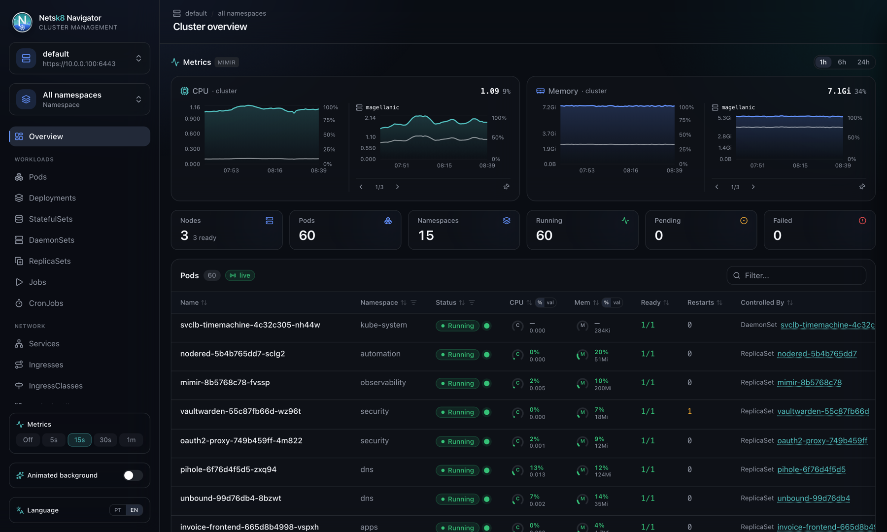
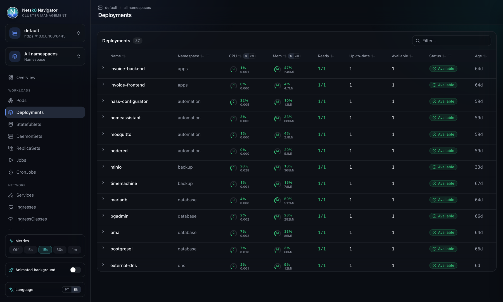
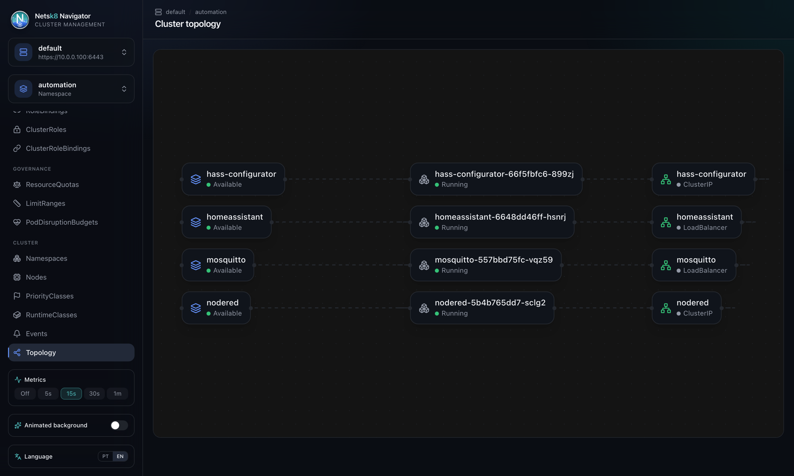
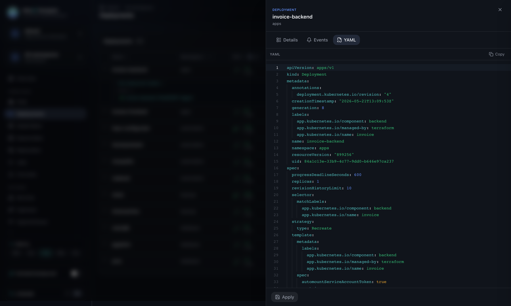
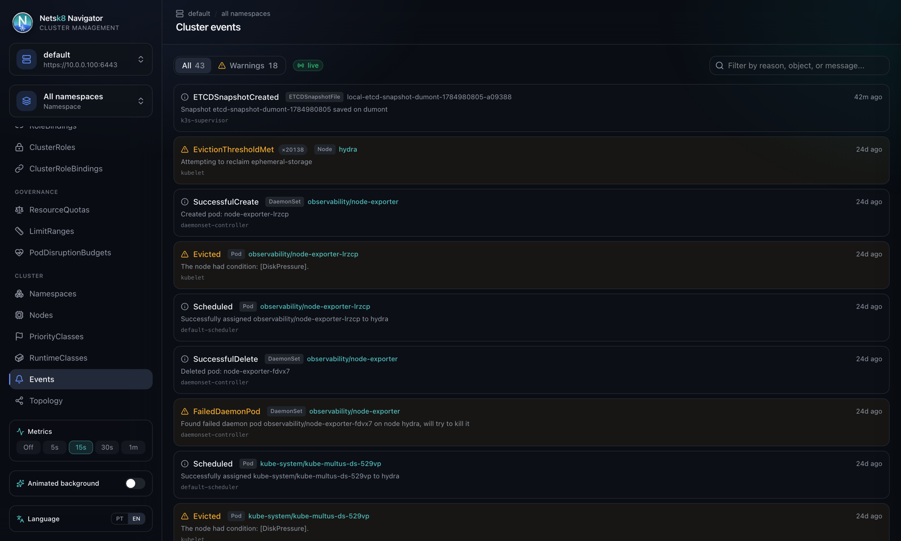

<p align="center">
  
</p>

<h1 align="center">Netsk8 Navigator</h1>

<p align="center">
  A Kubernetes cluster navigator in the browser — think Lens or k9s, but web.<br/>
  The name is a tribute to the old Netscape Navigator.
</p>

<p align="center">
  <a href="https://github.com/robertobado/netsk8-navigator/actions/workflows/ci.yml"></a>
  <a href="https://github.com/robertobado/netsk8-navigator/releases/latest"></a>
  <a href="LICENSE"></a>
</p>

<p align="center">
  <a href="https://sonarcloud.io/summary/new_code?id=robertobado_netsk8-navigator"></a>
  <a href="https://sonarcloud.io/summary/new_code?id=robertobado_netsk8-navigator"></a>
  <a href="https://sonarcloud.io/summary/new_code?id=robertobado_netsk8-navigator"></a>
  <a href="https://sonarcloud.io/summary/new_code?id=robertobado_netsk8-navigator"></a>
  <a href="https://sonarcloud.io/summary/new_code?id=robertobado_netsk8-navigator"></a>
</p>

<p align="center">
  
  
  
  
  
  
  
  
</p>

<p align="center">
  
</p>

<p align="center">
  
  
  
</p>

<p align="center">
  
</p>

---

## What it is

Netsk8 Navigator is an SPA that reads your `kubeconfig` and browses any
Kubernetes cluster (standard resources + CRDs) through a thin Go backend
that talks directly to the cluster API. Nothing installed on the cluster,
no agent, no state beyond your local preferences — the same trust model as
running `kubectl` from your own machine.

- 🗂️ **All standard resources** (Workloads, Network, Config, Storage, RBAC,
  Governance, Cluster) in filterable, sortable tables, with row expansion
  for relationships — Node → workloads, Namespace → resources, ConfigMap/
  Secret → consumers, ServiceAccount → bindings, and more.
- 🧩 **Generic CRD browser** for route resources (Gateway API, Traefik
  IngressRoute, Istio VirtualService, Contour HTTPProxy).
- 📝 **Detail view + YAML manifest editor** (Monaco) for reading and
  editing any object in place.
- 🔌 **Live logs, exec, and events** over SSE/WebSocket — pods stream in
  real time, no manual refresh.
- 📊 **CPU/memory metrics** at cluster, node, and pod level when the
  cluster exposes `metrics-server` or Prometheus.
- 🕸️ **Cluster topology** — a live graph of how workloads, pods, and
  services connect within a namespace.
- 🌐 **Multi-cluster & multi-version** — switch kubeconfig context without
  restarting anything; every resource is resolved via discovery/RESTMapper
  at request time, so it works against whatever Kubernetes version the
  cluster actually serves.

## See it in action

<table>
  <tr>
    <td width="50%"><br/><sub>Filterable, sortable resource tables</sub></td>
    <td width="50%"><br/><sub>Live topology: workloads → pods → services</sub></td>
  </tr>
  <tr>
    <td width="50%"><br/><sub>Read/edit any object's YAML in place</sub></td>
    <td width="50%"><br/><sub>Cluster-wide events, live and filterable</sub></td>
  </tr>
</table>

## Quick start

Ready-to-run binaries (Linux/macOS/Windows) + a Docker image on every
[release](https://github.com/robertobado/netsk8-navigator/releases) — no
need for Go/Node installed. Download the file for your platform, extract it
and run:

```bash
tar xzf netsk8-navigator_*_darwin_arm64.tar.gz   # or linux_amd64, windows_amd64.zip, etc.
./netsk8-navigator
```

Once it's ready, a release binary opens your default browser to the UI on
its own (Linux needs a desktop session — X11/Wayland — for this; a headless
server just skips it and logs the URL instead). Set `OPEN_BROWSER=false` to
turn this off, or `OPEN_BROWSER=true` to force it even for a `go run .`/
source build (which otherwise never auto-opens, so restarting during
development doesn't keep popping a new tab).

**On Debian/Ubuntu/Fedora/RHEL**, grab the `.deb`/`.rpm` from the release page
instead — installs `netsk8-navigator` onto your `PATH`:

```bash
sudo dpkg -i netsk8-navigator_*_amd64.deb   # Debian, Ubuntu, ...
sudo rpm -i netsk8-navigator_*_amd64.rpm    # Fedora, RHEL, ...
```

**On macOS**, prefer the `.dmg` on the release page instead: it's a signed,
notarized `.app` you can double-click, with its own icon — mount it, drag
"Netsk8 Navigator" to Applications, and open it (it opens a Terminal window
with the server logs and your browser to the UI; closing the Terminal quits
it). The raw `darwin_*.tar.gz` binaries above remain notarized too (fine to
run via Terminal), but a bare Unix binary can't have the notarization ticket
"stapled" to it, so double-clicking it directly in Finder may still warn.

Prefer Docker, or building from source? Keep reading.

### Docker

```bash
docker build -t netsk8-navigator .
docker run --rm -p 127.0.0.1:8080:8080 \
  -v "$HOME/.kube:/kube:ro" -e KUBECONFIG=/kube/config \
  netsk8-navigator
```

Map the port to `127.0.0.1` on the host only (as above) to keep the same
security model — without that, `-p 8080:8080` exposes the backend without
authentication to anything on your network.

If `~/.kube/config` is a **symlink pointing outside `~/.kube`** (common
with tools that switch contexts by swapping the link, e.g. environments
with multiple clusters), the mount above won't resolve the target — the
container only sees its own `~/.kube`. Mount the real file instead:

```bash
docker run --rm -p 127.0.0.1:8080:8080 \
  -v "$(readlink -f ~/.kube/config):/kube/config:ro" -e KUBECONFIG=/kube/config \
  netsk8-navigator
```

### Docker Compose

Equivalent to the `docker run` above, declaratively — see
[`docker-compose.yml`](docker-compose.yml) at the repo root:

```bash
docker compose up
```

It mounts `~/.kube/config` read-only and keeps the same loopback-only port
binding by default. Point it at a different kubeconfig file (e.g. the
resolved target of a symlinked one) without editing the file:

```bash
KUBECONFIG_HOST_PATH=$(readlink -f ~/.kube/config) docker compose up
```

### From source

Prerequisites: Go 1.26+, Node 20+, [pnpm](https://pnpm.io).

```bash
# Backend — API at http://127.0.0.1:8080 (reads ~/.kube/config, or $KUBECONFIG)
cd backend
go run .

# Frontend — dev server at http://localhost:5173, proxying /api → :8080
cd frontend
pnpm install
pnpm dev
```

Open `http://localhost:5173`.

```bash
# Useful commands
cd backend && go build ./... && go vet ./... && go test ./...          # backend
cd frontend && pnpm exec tsc -b && pnpm build                          # typecheck + build
cd frontend && pnpm exec oxlint src                                    # lint (the project's linter)
```

### Single binary (no Vite, no separate process)

Building the frontend before the backend embeds the SPA into the Go binary
(`internal/web`, via `go:embed`) — one process, one port, API and UI
together:

```bash
cd frontend && pnpm install && pnpm build   # generates backend/internal/web/dist
cd ../backend && go build -o netsk8-navigator .
ADDR=127.0.0.1:8080 ./netsk8-navigator      # open http://127.0.0.1:8080
```

Without the `pnpm build` step, `go build` still works normally — there's
just no embedded UI (the log says "no embedded frontend build"); this is
the normal path when you only want the API, or you're iterating on the
backend in dev.

## Architecture

```text
backend/    Go — client-go dynamic client + discovery RESTMapper, thin REST API
frontend/   React + Vite + TypeScript — Tailwind v4, TanStack Table/Query, Monaco
```

The design is **catalog-driven**: adding a standard resource is one entry
in the backend catalog (`backend/internal/api/catalog.go`) + one entry in
the frontend catalog (`frontend/src/lib/resources.tsx`) — no new handlers
or views. Full details on the extension pattern in
[ARCHITECTURE.md](ARCHITECTURE.md).

## Security model

By default, this backend **has no authentication, no TLS, and sends no CORS
headers beyond same-origin**. It can also mutate the cluster (apply
manifests via the Monaco editor), open an `exec` session in any pod, and
return decoded `Secret` values. Out of the box it's meant for **local use,
on your own machine, with your own kubeconfig** — the same trust level as
running `kubectl` directly.

- By default the backend listens only on `127.0.0.1:8080` (loopback). Only
  change `ADDR` to expose it on another interface if you understand the
  implications — that grants any process/machine that can reach the port
  the same access your kubeconfig credentials have.
- Don't run this as a shared service or behind an internet-facing proxy
  without turning on at least one of the options below (or fronting it with
  your own auth).

**Opt-in hardening** — all off by default, so local use stays zero-config:

- **`AUTH_PASSWORD`** (+ optional `AUTH_USER`, default `admin`) — turns on
  HTTP Basic Auth for the whole app. Basic Auth rather than a bearer token:
  once the browser authenticates, it automatically replays the same
  credentials on every later request — including the live-pods SSE feed
  and the exec terminal's WebSocket, neither of which browser JS can attach
  a custom header to.
- **`CORS_ORIGIN`** — allows one extra origin to call the API cross-origin
  (and to open the exec terminal's WebSocket). Unset by default: the
  embedded single-binary deployment is same-origin already and needs none,
  and the documented split dev setup (`pnpm dev` + `go run .`) works without
  it too, since Vite's own proxy already keeps the browser's requests
  same-origin.
- **`TLS_CERT` / `TLS_KEY`** — serve HTTPS directly (both must be set
  together). Most Kubernetes setups should terminate TLS at an Ingress
  instead (see below); this is for bare Docker/binary deployments that need
  TLS with no reverse proxy in front.
- **Audit log** — always on, no flag needed. Every manifest apply, pod exec
  session, and Secret detail read logs one `AUDIT` line (action, resource,
  source address) to stdout. There's no per-user identity to attribute it
  to (see above), so this is a trail of *what* happened and *from where*,
  not *who* — pair it with `AUTH_PASSWORD` (or your own auth) if you need
  the latter.

## Kubernetes (Helm)

A chart is included at [`charts/netsk8-navigator`](charts/netsk8-navigator):

```bash
helm install netsk8-navigator ./charts/netsk8-navigator
kubectl port-forward svc/netsk8-navigator 8080:8080
```

**Kubeconfig:** by default the app runs with no kubeconfig at all, so the
backend falls back to the pod's own in-cluster service account — it browses
whatever cluster it's deployed into, no configuration needed. To instead
point it at one or more *other* clusters (same as running the binary
locally with `$KUBECONFIG` set), create a Secret from an existing
kubeconfig file and point the chart at it:

```bash
kubectl create secret generic my-kubeconfig --from-file=config=$HOME/.kube/config
helm install netsk8-navigator ./charts/netsk8-navigator \
  --set kubeconfig.enabled=true \
  --set kubeconfig.secretName=my-kubeconfig
```

**RBAC:** `rbac.mode` (default `full`) grants the same broad,
kubectl-equivalent access described in *Security model* above —
cluster-wide read/write on every resource, since that's what lets the app
browse anything, apply manifests, exec into pods, and read Secret values.
For a safer default on a shared cluster, set `rbac.mode=readOnly`: it binds
Kubernetes' own built-in `view` ClusterRole instead (broad read, no apply,
no pod exec, and — the same restriction `view` has always had — no Secret
values). Set `rbac.create=false` to manage RBAC yourself entirely.

**Authentication:** set `auth.enabled=true` (+ `auth.existingSecret`, a
Secret with a `password` key) for the same built-in HTTP Basic Auth
described in *Security model* above:

```bash
kubectl create secret generic netsk8-navigator-auth --from-literal=password=<your-password>
helm install netsk8-navigator ./charts/netsk8-navigator \
  --set auth.enabled=true \
  --set auth.existingSecret=netsk8-navigator-auth
```

Otherwise this backend still has no authentication once deployed.
`service.type` defaults to `ClusterIP` (not reachable outside the cluster on
its own) — if you enable the chart's `ingress` or switch to a
`LoadBalancer`, turn on `auth.enabled` or put your own authentication in
front of it (an authenticated Ingress, an OAuth2 proxy, a NetworkPolicy
restricting who can reach it, ...).

See [`values.yaml`](charts/netsk8-navigator/values.yaml) for every option
(resources, ingress, node selectors, security contexts, ...).

## Cloud provider authentication (exec plugins)

Kubeconfigs for managed clusters (EKS, GKE, AKS, ...) almost always use an
`exec:` credential plugin instead of a static token — the kubeconfig just
names a command (`aws eks get-token`, `gke-gcloud-auth-plugin`,
`kubelogin`, ...) and client-go runs it fresh for every request, so a
short-lived cloud-issued token never has to sit in the kubeconfig file
itself. This is part of why the backend is written in Go instead of calling
the Kubernetes API directly from the frontend: exec plugins resolve
natively, with no separate implementation needed per cloud (see
[ARCHITECTURE.md](ARCHITECTURE.md)).

The plugin still has to actually *run*, though — the command has to be
installed, and its own credentials available, in whatever environment the
backend process is in.

- **From source, or the downloaded binary:** works with no extra setup —
  it's your own shell, so your existing `aws`/`gcloud`/`az`/`kubelogin`
  install and logged-in credentials are already there.
- **Docker / Docker Compose:** the default image is `distroless` (minimal,
  no shell, no CLIs) and can't run these commands itself. Use the
  `-cloud-auth` image instead — same binary, published alongside the
  default one on every release, with the AWS CLI, Google Cloud CLI (+
  `gke-gcloud-auth-plugin`), and Azure CLI (+ `kubelogin`) already
  installed on a `debian-slim` base:

  ```bash
  docker run --rm -p 127.0.0.1:8080:8080 \
    -v "$(readlink -f ~/.kube/config):/kube/config:ro" -e KUBECONFIG=/kube/config \
    -v "$HOME/.aws:/home/nonroot/.aws:ro" -e AWS_PROFILE=your-profile \
    ghcr.io/robertobado/netsk8-navigator:latest-cloud-auth
  ```

  Same idea for GCP (mount `~/.config/gcloud`) or Azure (mount `~/.azure`).
  Prefer building it yourself? `docker build -f Dockerfile.cloud-auth -t
  netsk8-navigator:cloud-auth .`.

- **Kubernetes (Helm):** same idea, one level up — point `image.tag` at the
  `-cloud-auth` variant and mount the matching cloud credentials via
  `extraVolumes`/`extraVolumeMounts`:

  ```yaml
  image:
    tag: latest-cloud-auth
  kubeconfig:
    enabled: true
    secretName: my-kubeconfig
  env:
    - name: AWS_PROFILE
      value: your-profile
  extraVolumes:
    - name: aws-creds
      secret:
        secretName: aws-credentials
  extraVolumeMounts:
    - name: aws-creds
      mountPath: /home/nonroot/.aws
      readOnly: true
  ```

  (`kubectl create secret generic aws-credentials --from-file=credentials=$HOME/.aws/credentials`)

None of this applies if you're only browsing the cluster the app is
deployed into — the default in-cluster service account fallback needs no
exec plugin at all.

## Contributing

Issues and pull requests are welcome — the catalog-driven design in
[ARCHITECTURE.md](ARCHITECTURE.md) makes adding a new resource type a small,
self-contained change. Before opening a PR, make sure `go build ./... && go
vet ./... && go test ./...` (backend) and `pnpm exec tsc -b && pnpm build &&
pnpm exec oxlint src` (frontend) all pass — the same checks run in CI.

Want to help translate the app instead? See [TRANSLATIONS.md](TRANSLATIONS.md) —
no Go or build tooling knowledge needed, just one file to edit.

## License

[MIT](LICENSE)
