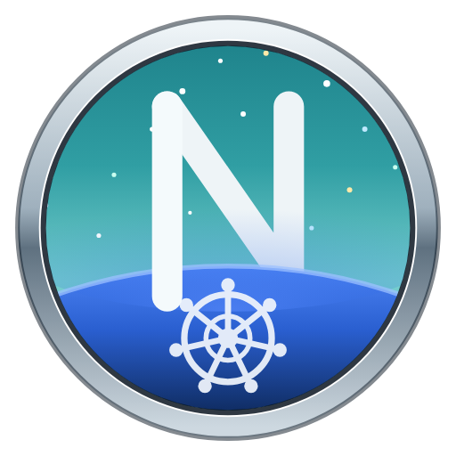

<p align="center">
  
</p>

<h1 align="center">Netsk8 Navigator</h1>

<p align="center">
  A Kubernetes cluster navigator in the browser — think Lens or k9s, but web.<br/>
  The name is a tribute to the old Netscape Navigator.
</p>

<p align="center">
  <a href="https://github.com/robertobado/netsk8-navigator/actions/workflows/ci.yml"></a>
  <a href="https://github.com/robertobado/netsk8-navigator/releases/latest"></a>
  <a href="LICENSE"></a>
</p>

<p align="center">
  <a href="https://sonarcloud.io/summary/new_code?id=robertobado_netsk8-navigator"></a>
  <a href="https://sonarcloud.io/summary/new_code?id=robertobado_netsk8-navigator"></a>
  <a href="https://sonarcloud.io/summary/new_code?id=robertobado_netsk8-navigator"></a>
  <a href="https://sonarcloud.io/summary/new_code?id=robertobado_netsk8-navigator"></a>
  <a href="https://sonarcloud.io/summary/new_code?id=robertobado_netsk8-navigator"></a>
</p>

---

## Releases

Ready-to-run binaries (Linux/macOS/Windows) + a Docker image on every
[release](https://github.com/robertobado/netsk8-navigator/releases) — no
need for Go/Node installed. Download the file for your platform, extract it
and run:

```bash
tar xzf netsk8-navigator_*_darwin_arm64.tar.gz   # or linux_amd64, windows_amd64.zip, etc.
./netsk8-navigator
```

Prefer running from source or via Docker? See the sections below.

## What it is

Netsk8 Navigator is an SPA that reads your `kubeconfig` and browses any
Kubernetes cluster (standard resources + CRDs) through a thin Go backend
that talks directly to the cluster API. Nothing installed on the cluster,
no agent, no state beyond your local preferences.

- Tables for all standard resources (Workloads, Network, Config, Storage,
  RBAC, Governance, Cluster) — filterable, with row expansion for
  relationships (Node → workloads, Namespace → resources, ConfigMap/Secret →
  consumers, …).
- Generic browser for route CRDs (Gateway API, Traefik IngressRoute, Istio
  VirtualService, Contour).
- Detail view + YAML manifest (Monaco editor) for in-place reading and
  editing.
- Real-time pod logs, exec, and events (SSE/WebSocket).
- CPU/memory metrics (cluster, node, pod) when the cluster exposes
  `metrics-server` or Prometheus.
- Multi-cluster: switch kubeconfig context without restarting anything.
- Multi-version: each resource is resolved via discovery/RESTMapper at
  request time, so it works against any Kubernetes version the cluster
  serves.

## Architecture

```text
backend/    Go — client-go dynamic client + discovery RESTMapper, thin REST API
frontend/   React + Vite + TypeScript — Tailwind v4, TanStack Table/Query, Monaco
```

The design is **catalog-driven**: adding a standard resource is one entry
in the backend catalog (`backend/internal/api/catalog.go`) + one entry in
the frontend catalog (`frontend/src/lib/resources.tsx`) — no new handlers
or views. Full details on the extension pattern in
[ARCHITECTURE.md](ARCHITECTURE.md).

## Running locally

Prerequisites: Go 1.26+, Node 20+, [pnpm](https://pnpm.io).

```bash
# Backend — API at http://127.0.0.1:8080 (reads ~/.kube/config, or $KUBECONFIG)
cd backend
go run .

# Frontend — dev server at http://localhost:5173, proxying /api → :8080
cd frontend
pnpm install
pnpm dev
```

Open `http://localhost:5173`.

### Useful commands

```bash
# Backend
cd backend && go build ./... && go vet ./... && go test ./...

# Frontend
cd frontend && pnpm exec tsc -b && pnpm build   # typecheck + build
cd frontend && pnpm exec oxlint src              # lint (the project's linter)
```

## Single binary (no Vite, no separate process)

Building the frontend before the backend embeds the SPA into the Go binary
(`internal/web`, via `go:embed`) — one process, one port, API and UI
together:

```bash
cd frontend && pnpm install && pnpm build   # generates backend/internal/web/dist
cd ../backend && go build -o netsk8-navigator .
ADDR=127.0.0.1:8080 ./netsk8-navigator      # open http://127.0.0.1:8080
```

Without the `pnpm build` step, `go build` still works normally — there's
just no embedded UI (the log says "no embedded frontend build"); this is
the normal path when you only want the API, or you're iterating on the
backend in dev.

## Docker

```bash
docker build -t netsk8-navigator .
docker run --rm -p 127.0.0.1:8080:8080 \
  -v "$HOME/.kube:/kube:ro" -e KUBECONFIG=/kube/config \
  netsk8-navigator
```

Map the port to `127.0.0.1` on the host only (as above) to keep the same
security model — without that, `-p 8080:8080` exposes the backend without
authentication to anything on your network.

If `~/.kube/config` is a **symlink pointing outside `~/.kube`** (common
with tools that switch contexts by swapping the link, e.g. environments
with multiple clusters), the mount above won't resolve the target — the
container only sees its own `~/.kube`. Mount the real file instead:

```bash
docker run --rm -p 127.0.0.1:8080:8080 \
  -v "$(readlink -f ~/.kube/config):/kube/config:ro" -e KUBECONFIG=/kube/config \
  netsk8-navigator
```

## Security model

This backend **has no authentication, no TLS, and uses CORS `*`**. It can
also mutate the cluster (apply manifests via the Monaco editor), open an
`exec` session in any pod, and return decoded `Secret` values. It's meant
for **local use, on your own machine, with your own kubeconfig** — the
same trust level as running `kubectl` directly.

- By default the backend listens only on `127.0.0.1:8080` (loopback). Only
  change `ADDR` to expose it on another interface if you understand the
  implications — that grants any process/machine that can reach the port
  the same access your kubeconfig credentials have.
- Don't run this as a shared service or behind an internet-facing proxy
  without putting authentication/authorization in front of it.

## License

[MIT](LICENSE)
